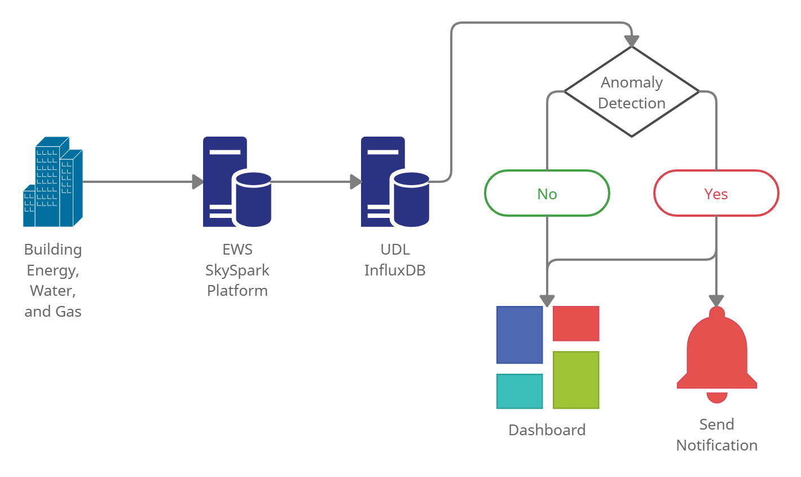
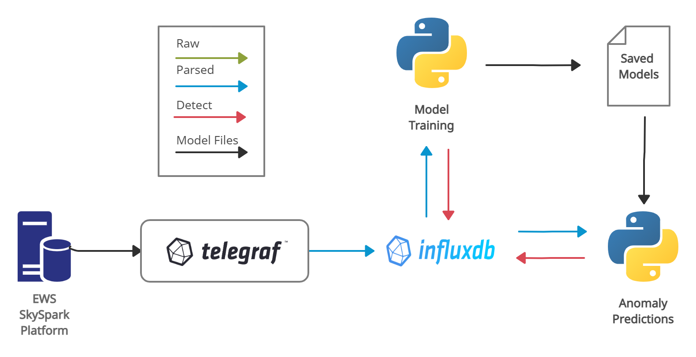
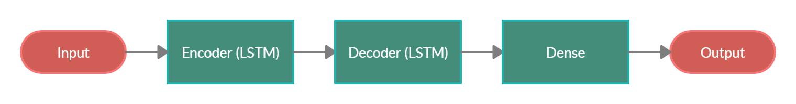

# Real-time Anomaly Detection for Building Sensors

This project was completed as the Capstone Project for the UBC Okanagan Master of Data Science (MDS) degree. The project was completed for [Urban Data Lab](https://urbandatalab.io/) by [Nathan Smith](https://github.com/WraySmith), [Mitch Harris](https://github.com/mqharris), and [Ryan Koenig](https://github.com/RyKoe). The project was completed in a 7-week timeline from proposal to final report.

The project provides a proposed approach for a near real-time anomaly detection system with Urban Data Lab's database. The approach includes a framework for model anomaly detection model training and prediction with InfluxDB using open-source software.

This README provides on overview of the project repository and is organized into:

* [Project Description](#project-description)
* [Code](#code)
* [Research](#research)
* [Data](#data)
* [Project Documents](#project-documents)
* [Project Management](#project-management)

Note that there are READMEs provided in subfolders for additional information.

The main project code package can be found [here](code/model/) and a walk-through in notebook format using a test environment can be found [here](placeholder). 

## Project Description

### Background
The Urban Data Lab (UDL) advances data access, data management and data analytics capabilities on the University of British Columbia (UBC) campus with a goal of addressing campus-wide sustainability challenges. UDL has access to the UBC Energy and Water Services (EWS) SkySpark analytics platform that collects data from buildings on the UBC campus including information such as heating, ventilation and air conditioning (HVAC) equipment and energy data. UDL stores data from SkySpark in their own database using InfluxDB and have potentially erroneous data reporting from SkySpark. There is currently no system in place with InfluxDB to flag these data. The project goal was to develop a real-time anomaly detection system using open-source tools that could be used with InfluxDB.

  

### Anomaly Detection Framework

The approach used in this study provides near real-time anomaly detection with InfluxDB. Anomaly detection model training is completed by querying sensor data from InfluxDB on an infrequent basis and saving the trained models. Anomaly detection prediction occurs on a continuous basis by reading recent data from InfluxDB, loading and running the previously trained models, and writing the results back to InfluxDB. A subset of Campus Energy Sensor (CEC) boiler sensors available in SkySpark was selected for the study to test this approach.

  

### Anomaly Detection Model
The anomaly detection model used in this study is a long short-term memory recurrent neural network with an encoder-decoder architecture (LSTM-ED). The LSTM-ED was selected as it provides a general model noted to have good performance in recent anomaly detection studies and should be applicable to a variety of sensors. This generalizability was a goal of the project. The model is trained in an unsupervised approach using sequence reconstruction of the input data. Anomaly prediction is then based on identification of data with high sequence reconstruction error. The study results indicate that the model has good performance on the selected subset of CEC sensors.

  

### Dashboard and Notification System

A dashboard and notification system were also implemented with the anomaly detection model in a test InfluxDB environment. The dashboard can be built directly in InfluxDB and provides a simple display of sensor data overlaid with anomalous flagged data. The notification system also uses built-in InfluxDB functionality and was configured to send notifications for data predicted as anomalous. 

**ADD SCREENSHOT HERE**

### Conclusion

This study provides an initial open-source anomaly detection approach that can be used by UDL with InfluxDB. Additional studies that can be considered as next steps include implementing anomaly detection directly in-line with data being written to InfluxDB, comparison of the LSTM-ED with additional models, testing additional sensors and buildings/systems, and building more complex dashboard and notification systems.

Ideally, the detection system could ultimately be used to provide campus and building managers with the real-time or near real-time notifications of potential issues in system operations reducing operational costs, downtime, and unexpected maintenance.

## Code

The [code directory](code/) contains the project code used to build the anomaly detection model. The directory also contains tools used to complete the project and a test environment used for the detection framework.

The directory has:

- [docker-files](code/docker-files/) includes several docker setups used to run InfluxDB/Telegraf locally
- [labeller-app](code/labeller-app/) is a Shiny App that can be used to visualize sensor data and graphically select and update labelling of the data as normal or anomalous
- [model](code/model/) provides the python functions and scripts used for anomaly detection
- [notebook-demo](code/notebook-demo/) provides various jupyter notebooks
- [results](code/results/) includes results from LSTM-ED model testing on the CEC sensors used in the study
- [test-env](create-test-env) provides a detailed jupyter notebook walk-through of the anomaly detection framework in a test environment

A more detailed README is available in the directory and there are READMEs within each of the directory subfolders.

## Research

The [research directory](research/) provides various documents and code associated with researching/exploring various aspects of the project during development. These include:

- [EDA](research/EDA/) - exploratory data analysis completed at the start of the project to provide an understanding various CEC sensor data
- [dashboard-research](research/dashboard-research.md) - initial research on dashboards with InfluxDB or Grafana to understand the level of effort associated with the task
- [model-methods](research/model-methods/) - initial research and selection of the model to be used for the study (includes various test files)
- [papers](research/papers/) - papers used in the study
- [SR-testing](research/SR-testing) - testing spectral residual transformations to assess if the transformation could be useful in anomaly identification.
- [streaming-methods](research/streaming-methods/) - various tests on streaming methods that could be used with InfluxDB

A more detailed README is provided in the [directory](research/).

## Data

Includes data used to test the anomaly detection model and code:

- [unlabelled-skyspark-data](data/unlabelled-skyspark-data) - these data were manually downloaded from the SkySpark user interface
- [labelled-skyspark-data](data/labelled-skyspark-data) - data manually labelled as anomalous or normal
- [testing-data](data/testing-data/) - data that has been manually altered to replicate a set of a data from an original sensor to support code testing

A more detailed README is provided in the [directory](data/).
## Project Documents

Project deliverables for the MDS:

- [proposal](proposal/) - proposal report and presentation   
- [final-report](final-report) - final report and presentation

## Project Management

Various project management documents/tools used including:

- [meeting-minutes](meeting-minutes/) - client meeting minutes and sprint planning documents
- [misc-docs](misc-docs/) - miscellaneous documents such as `team-contract.md` and `code-standards.md`
- [personal-logs](personal-logs/) - each team-members daily time logs, summary of weekly time spent in `weekly-summary.xlsx` as well as a README with a brief summary of each week
- [weekly-updates](weekly-updates/) - weekly presentations to UBC supervisors
