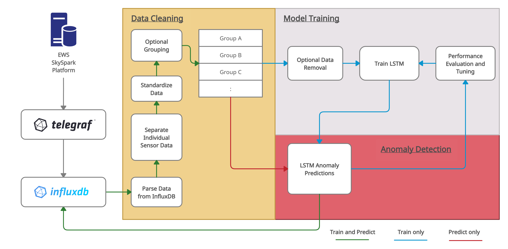

# Code

The Python environment used for project development can be installed using anaconda or miniconda with the following command from this directory:

`conda env create -f environment.yml`

This will create the `anomaly` environment which can then be activated using:

`conda activate anomaly`

The environment uses Python 3.7 and has influxdb-client, jupyterlab, pandas, scikit-learn, and tensorflow.

Alternatively, the required packages are located in `requirements.txt`.

## docker-files

Includes docker setups used to run InfluxDB/Telegraf locally. Also provides a docker file that can be used to modify a telegraf image to include Python installed in the container.

## labeller-app

Shiny App that can be used to visualize sensor data and graphically select and update labelling of the data as normal or anomalous. This was built to support manual labelling of anomalous data (used in Phase 1 Testing). Additional details and a demo are available in the folder README. This app may be useful for future use to visualize data.

## misc-notebooks

This folder currently contains miscellaneous files created during development. These have been left in the repository as they may provide useful information for future development. Note that they are not directly useable/updated with the latest model, but just provide guidance.

## model

Provides code for the model training and anomaly predictions with the anomaly detection framework.

  

The model pipeline implemented is shown below (details are provided in the final report).

  

The directory contains a README that provides a description of  the files.

## results

Model testing of the LSTM-ED in notebook format. This corresponds with the Phase 1 and Phase 2 testing discussing in the final report.

## test-env
 
Provides a detailed jupyter notebook walk-through of the anomaly detection framework in a test InfluxDB environment. Includes testing the model training (including saving model files), model predictions (including loading the model files), dashboard, and notification system.
